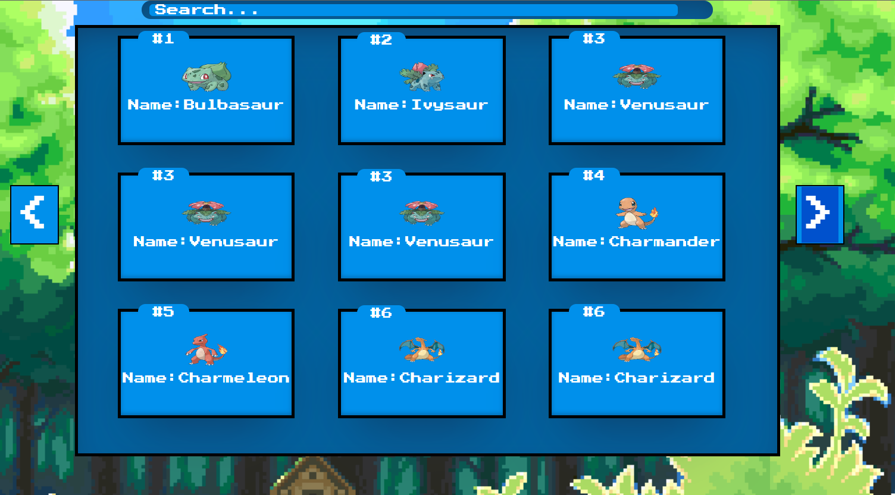

<article class="markdown-body entry-content container-lg" itemprop="text"><h1 tabindex="-1" dir="auto">

<h1>Pokedex Project</h1>
<br>



The Pokedex Showcase is a personal project aimed at creating a visually appealing and functional pokedex whie retreiving information from a local API using Html, css ,javascript and Ness.css

<h2>Usage</h2>

1. **Home Page:** A beautiful introduction to the pokedex application
2. **Card_carrousel:** The main matrix that displays a 3x3 pokemon list, with a searchbar on the top where you can find any pokemon you want
3. **Modals for each card:** When you click over a card or search for a pokemon, a modal with the information of each pokemon is displayed.

## Instructions to Run Locally

1. **Clone the Repository:** Use the following command to clone the repository to your local machine:
   ```
   git clone
   ```

2. **Navigate to Project Directory:** Move to the project directory using the following command:
   ```
   cd pokedex
   ```

3. **Install Dependencies:** Install the project's dependencies using your preferred package manager (e.g., npm or yarn):
   ```
   npm install
   ```
`


4. **Access the Portfolio:** display the webpage on your preferred browser
